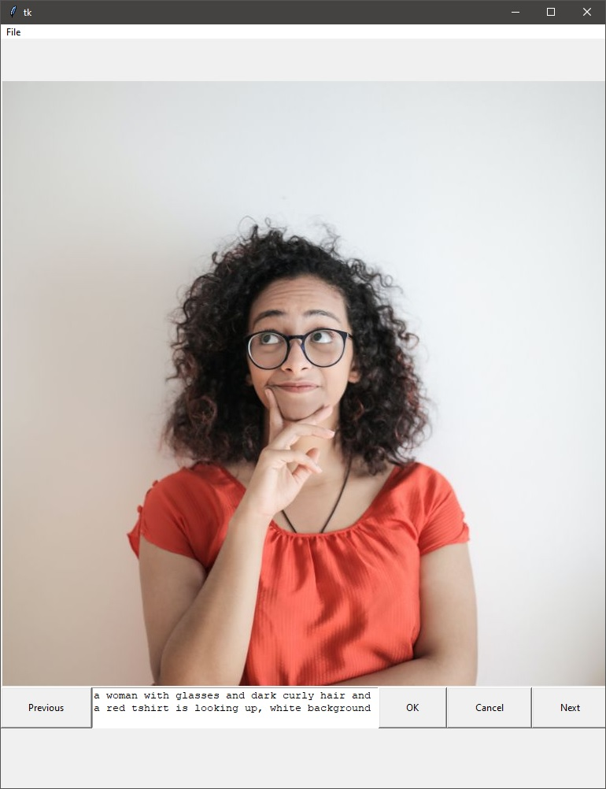

# ClipApp - Manual Image Annotation Helper

This app is intended for annotating folders with images for training a generative AI like stable diffusion. It allows 
you to navigate through the images in a folder, view them, edit and save the captions for each image. 



## Installation

Clone the repository using the command below (or download the zip file)

```bash
git clone https://github.com/yourusername/image-annotation-app.git
```

Run the app

```bash
python app.py
```

## Usage

When the app starts, click File --> Open to select the folder containing the images to be annotated.

Once the folder is selected, the first image will be displayed along with its caption (if that existed)

Use the "Previous" and "Next" buttons to navigate through the images.

Use the text box below the image to add or edit the caption for the image.

Use the "OK" button to save the changes and "Cancel" to discard any changes.

From the "File" menu, select "Open" to change the folder containing the images.

Select "Exit" to close the app.

## Development

Install the requirements:

```bash
pip install -r requirements.txt
```

Building executable using Nuitka (for Windows)

```bash
nuitka --standalone --windows-disable-console --enable-plugin=tk-inter --onefile app.py
```

Running unit-test, located in ```./tests/``` using pytest:

```bash
pytest
```

## Notes

ClipApp only considers the images with the following extensions: .jpg, .jpeg, .png, .gif and, .bmp.
ClipApp creates an empty txt file with the same name of the image, in the same folder where the image is when a caption isn't 
available.

## Contribution

If you want to contribute to this project, please open a pull request. Feel free to open an issue if you find a bug or have a feature request.

## License

This project is licensed under the MIT License - see the LICENSE file for details.
